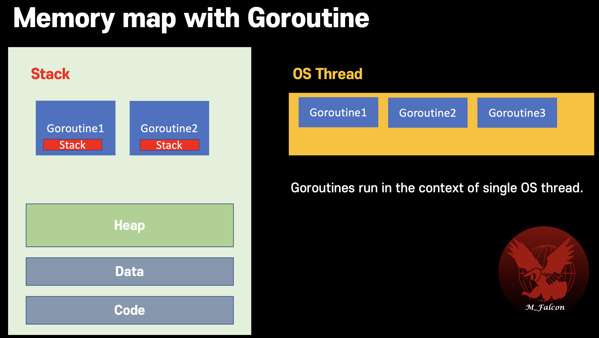
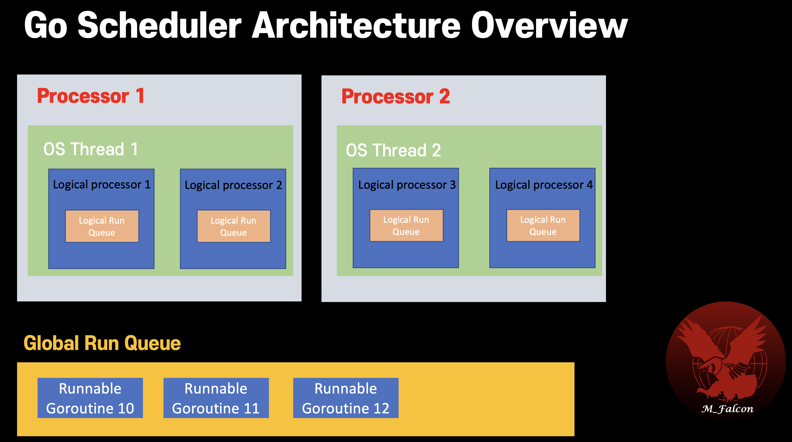
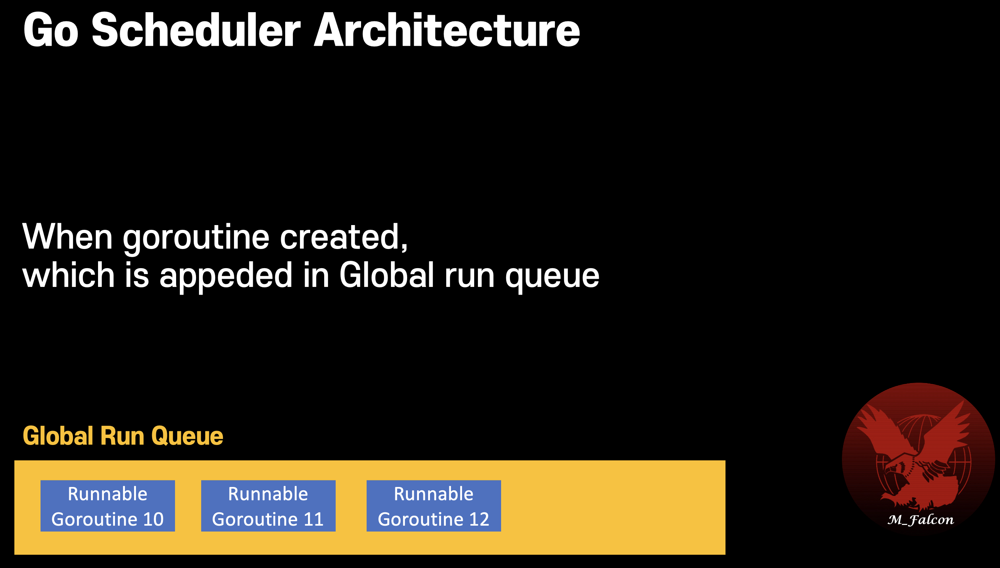
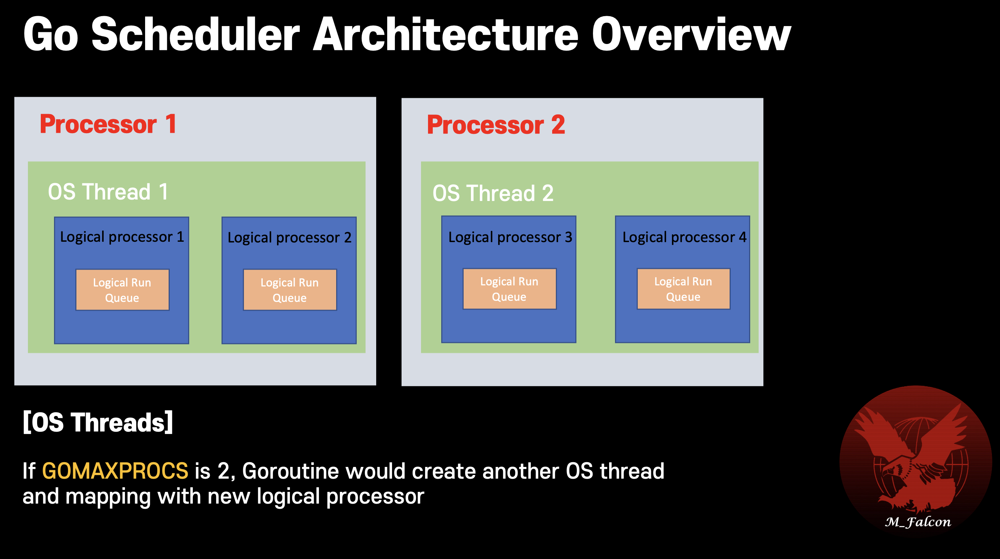
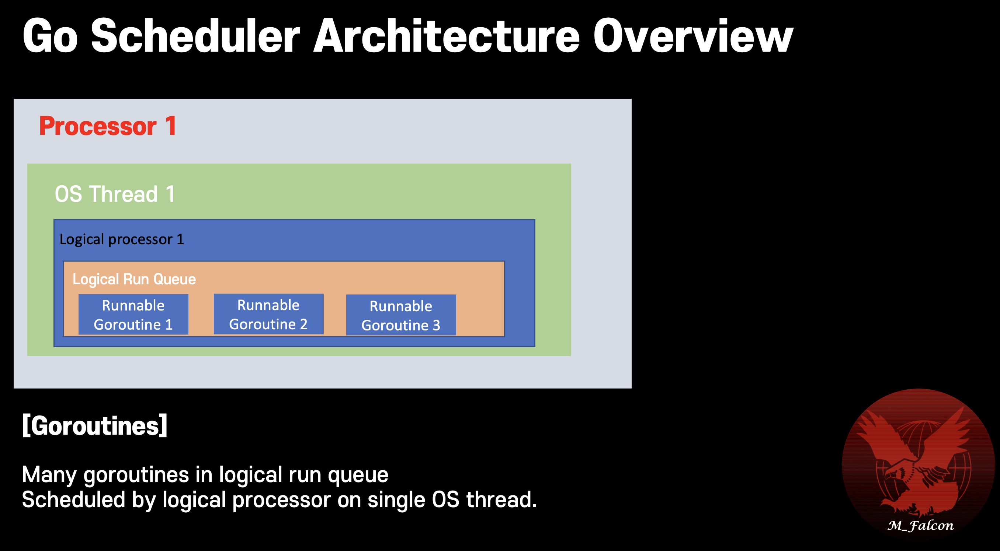
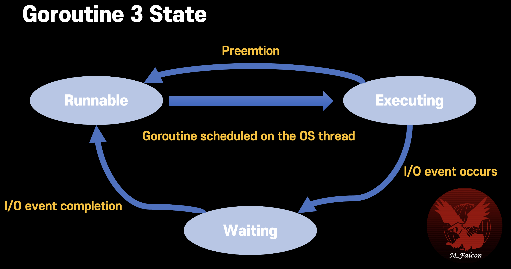

# Goroutine

## Old concurrency problem
- Race condition \
  This occurs when order of execution is not guaranteed.
- Deadlock \
  Concurrent program has risk of Blocking.


Expect next program output. \
It shows race condition , _this program output is different whenever execution._
```go
package goroutine

import (
	"log"
	"testing"
)

func TestGoroutine(t *testing.T) {
	var sharedData int = 0

	go func() {
		sharedData++
	}()

	if sharedData == 0 { // if goroutine gets scheduled after this line
		// sharedData is already '1' incremented from 0
		log.Printf("Data is %v", sharedData) // print 1
	}
}
```

## Solution
Locking mechanism (e.g. Mutex, Semaphore) 

## Limit of locking
1. Reduce performance, parallelism since it forces to execute sequentially
2. Deadlock risk if there's circular reference.

---

## Communicating Sequential Process (CSP)
- Each process is built for sequential execution.
- Data is communicated between processes. \
**_No shared memory_** \
=> This protects from deadlock or race condition.
- Scale by adding more of the same.

---


# Concurrency in go
## Goroutines
Goroutine is user space light-weight thread managed by go runtime. \
Goroutines starts with 2KB of stack whcih grows and shrinks as required. \
Can create hundreds of thousdands of goroutines in the same address space. \
Goroutine doesn't use shared memory to avoid deadlock or race condition problem.

> Goroutine is different to thread. \
> This is running in the context of the OS threads.
> Many goroutines can be executed in the context of the single OS thread.

### Memory map of goroutine


## WaitGroup
#### Wrong example
**_Calling `WaitGroup.Add()` in function is bad approach._** \
If goroutine failed to get scheduling, then main routine return without blocking leaving goroutine is not executed.

```go
func asyncDoSomething(wg *sync.WaitGroup) {
	wg.Add(1)       // ❌ increment is not executed if goroutine couldn't have the chance to be executed.
	defer wg.Done() // decrement dynamically
    // ..
}

func main() {
  	waitGroup := &sync.WaitGroup{}
    go asyncDoSomething(waitGroup)
    waitGroup.Wait()
}
```

#### Right example
> Always use `waitGroup.add()` outside of goroutine function. \
For goroutine have to have chance to execute.

```go
func asyncDoSomething(wg *sync.WaitGroup) {
	defer wg.Done()
    // ..
}

func main() {
  	waitGroup := &sync.WaitGroup{}
    waitGroup.add(1) // ✅ Enclosure scope add()
    go asyncDoSomething(waitGroup)
    waitGroup.Wait()
}
```

## Scheduling in goroutine
- Go scheduler is a part of the Go runtime. It's known as M:N scheduler.
- Go scheduler runs in user space.
- Go scheduler uses OS threads to schedule goroutines for execution.
- Go runtime creates number of worker OS threads, equal to GOMAXPROCS. \
GOMAXPROCS : default value is number of processors on machine.
- GO scheduler distrbiutes runnable goroutines over multiple worker OS threads.
- N goroutines could be scheduled on M OS threads that run on at most GOMAXPROCS numbers of processors.
- Time slice `10ms` is set, so when goroutine is running for more than 10ms, Go will try to preempt it. (Asynchronous preemptive scheduling) \
This is for protecting specific goroutine hog on the CPU for long time.

### Overview


### Global Run Queue


### OS Thread


### Logical Run Queue


**Go scheduler periodically checks each logical run queue of logical processor and reassigns the goroutines as needed to balance the load.** \
This is mechanism of load balancing protecting specific logical processor from being overloaded. \
In other world, each logical processor has logical run queue, and which can take other one's goroutines when it's idle.

---

## State of goroutine


### Runnable
Wait in the run queue.

### Executing
Running state on OS thread \
Runnable state to Executing state when preempted by scheduler as time goes by more than time slice (Default `10 ms`).


### Waiting
Waiting state
Running state to this state when I/O or event wait (e.g. blocked on channel, blocked on a system call or waiting for the mutex lock) \
After I/O or event completes, moved back to the runnable state.


---
## Synchronous system call
### Problem
Synchronous system call blocks the thread until I/O is to be completed. \
When synchronous system call occurs, OS thread is to be waiting state, and enqueue into waiting queue. This is not occupied by CPU. \
This means synchronous system call reduces parallelism.
multiple goroutines can't be executed parallely since OS thread is blocked and waiting which has multiple logical processor including goroutine,

> How to handle this problem in go scheduler?

### Solution
Go scheduler gets another OS thread from thread pool or creates new one. \
Process is shown below


1. Synchronous system call occurs. (e.g. File Read)
2. OS thread is blocked and transforming state from running to waiting. \
Which is located into waiting queue.
3. Go scheduler gets another OS thread from thread pool cache or creates new one.
4. And move the logical processor to new one except goroutine which makes I/O task.
5. With new OS thread, the other goroutines are activated by go scheduler.
6. In one side, IO completion, the I/O goroutine is returned to new OS thread.
7. Old OS thread is returned to thread pool cache.


## Asynchronous system call
### Problem
Asynchronous system call occurs when file descriptor (**FD** as acronym) is used on network IO with non-blocking mode. \
Async syscall doesn't block the OS thread but occurs error when the socket buffer is empty trying Read or buffer full trying Write. \
In async mode, it should provide retrying mechanism network IO after error occurs. \
How does go handle this problem?

### Solution
Go uses [NetPoller](https://github.com/golang/go/blob/master/src/runtime/netpoll.go) for handling asynchronous system call. \
The NetPoller uses interface provided by OS (epoll kqueue, IOPC) to do polling status of FD.


1. Asynchronous system call occurs in goroutine
2. Go scheduler move the goroutine to NetPoller thread out of OS thread which is created.
3. NetPoller do polling the status of FD
4. If IO operation is ready, NetPoller could get notification from OS
5. NetPoller will notify to the goroutine to retry I/O
6. The goroutine would return to origin logical run queue when I/O operation completes.


## channels
## Select (multiplex the channel)
## Sync package


